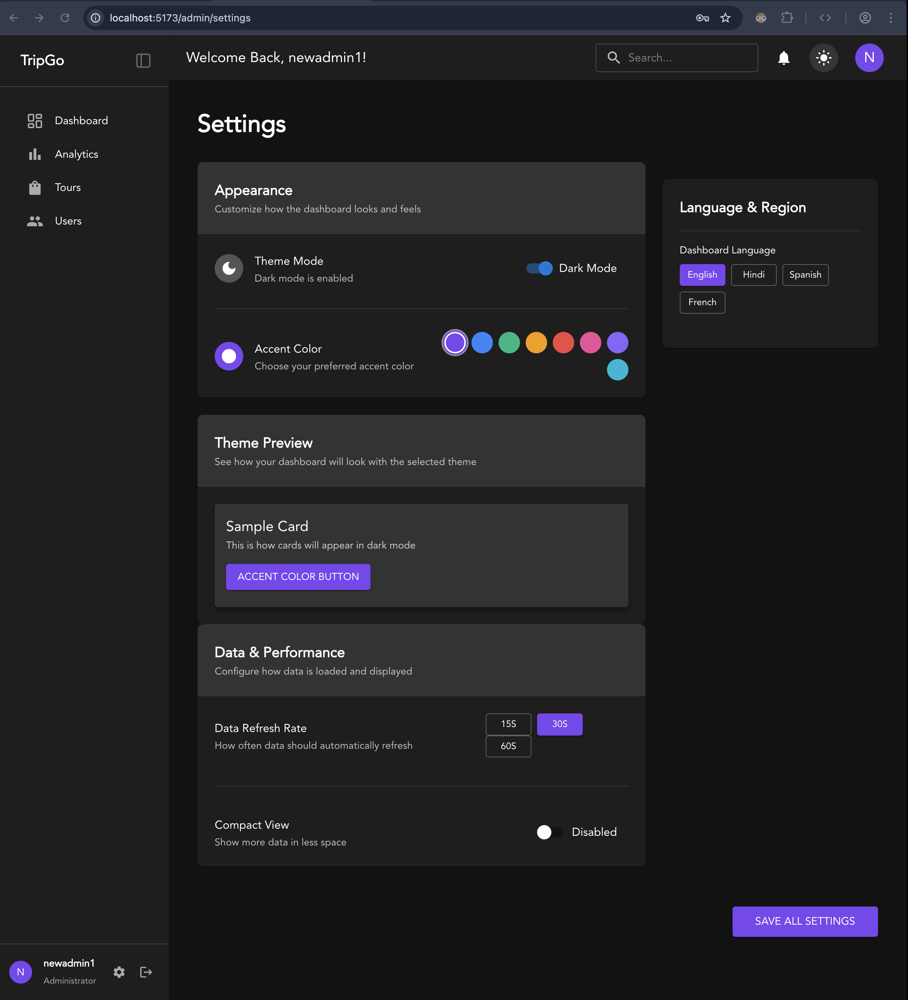

# ⚡ Quick Start Guide

## 🚀 Start the App

Install dependencies:

```bash
pnpm i
```

Run the development server:

```bash
pnpm run dev
```

> ✅ No need to `cd` into the backend — thanks to [`concurrently`](https://www.npmjs.com/package/concurrently), both frontend and backend start together.

---

## 🌐 Frontend

Access the app at: **[http://localhost:5173](http://localhost:5173)**

---

## 📋 API Documentation (Swagger)

View API docs at: **[http://localhost:5001/api-docs](http://localhost:5001/api-docs)**

---

## 🔐 Authentication Routes

- **Register**: `POST` → [`http://localhost:5173/signup`](http://localhost:5173/signup)

- **Login**: `POST` → [`http://localhost:5173/login`](http://localhost:5173/login)

---

## 🏕️ Accommodation Routes

- **Get All Tents**: `GET` → `/tours`

---

## 🛠 Admin Access

Admin Panel: **[http://localhost:5173/admin](http://localhost:5173/admin)**

**Credentials:**

- **Email**: `newadmin@newadmin.com`
- **Password**: `newadmin@newadmin.com`

---

## 🎨 Admin Panel Customization

Within the bottom-left **Settings** menu of the Admin Panel, you can customize:

- 🌍 **Language**
- 🎨 **Accent Color**
- 🌓 **Theme**: Light / Dark / System

## 🖼️ Admin Settings Preview

